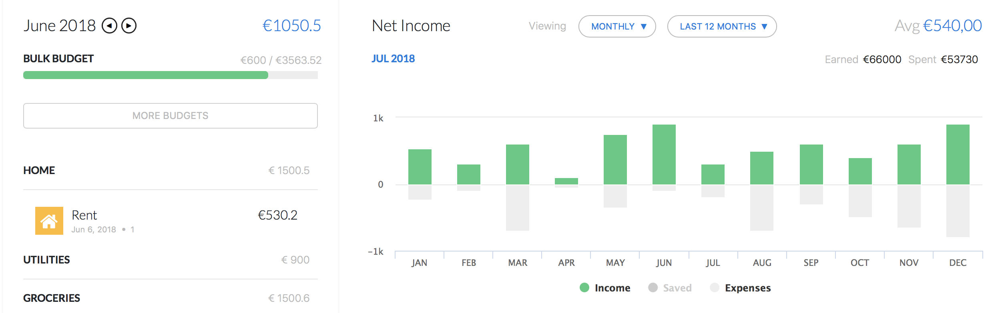

# Saver
Angular Web Application for monitoring your expenses.

* WIP

## Getting Started

### Prerequisites

### Installing

### More information

### Development

### Usage

## Built with 
* [HTML 5](https://www.w3schools.com/html/) - To get some basic markup and text done.
* [CSS 3](https://www.w3schools.com/css/) - So the html markup has some styling.
* [JavaScript](https://www.javascript.com) - For getting some interaction on the web app.
* [TypeScript](https://www.typescriptlang.org/index.html) - For bringing the OOP principals to javascript. 
* [MySQL](https://www.mysql.com/) - For the database.
* [IntelliJ Idea](https://www.jetbrains.com/idea/) - In what we developed the (start) application.

# Dependencies/ Frameworks 
* [Angular 6](https://angular.io) - JavaScript Framework to build an Web Application (Routing, Http requests, MVC, Components, etc.). 
* [Node.js](https://nodejs.org/) - So we can get data trough a API from our database in Json format.
* [Express.js](https://expressjs.com) - Small framework for building the robust API.
* [Bootstrap 4](https://v4-alpha.getbootstrap.com) - So we don't have to reinvent the 'css' wheel 100*.

# Dependencies/ Libraries 
* [@angular](info) - Dependencies for Angular
* [ngx-pwa](https://www.npmjs.com/package/@ngx-pwa/local-storage) - For handling the local storage.
* [ng Font Awsome](https://www.npmjs.com/package/angular-font-awesome) - For easy use of icons.
* [ng highcharts](https://www.npmjs.com/package/angular-highcharts) - For all the charts and graphs.
* [jQuery](https://jquery.com) - For Document traversal and manipulation, event handling and more animations.
* [async](https://www.npmjs.com/package/async) - Tool for handling asynchronous JavaScript in node.js.

# Managers 
* [Npm.js](https://www.npmjs.com) - To manage all of the npm packages
* [ng Cli](https://cli.angular.io) - Command line interface for Angular
* [rxjs](https://www.npmjs.com/package/rxjs) - Reactive Extensions For JavaScript development.

## Built By

* **Thijs Zijdel** 

## Project Files

## License

This project is licensed under the MIT License - look at [LICENSE.md](LICENSE.md) file for details.
